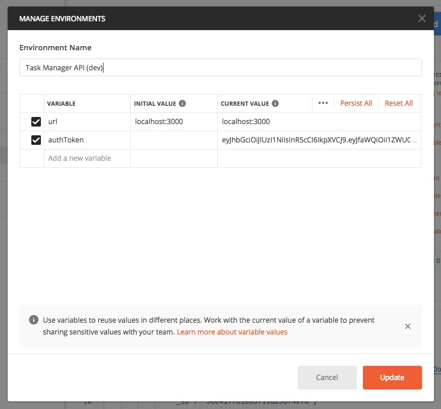
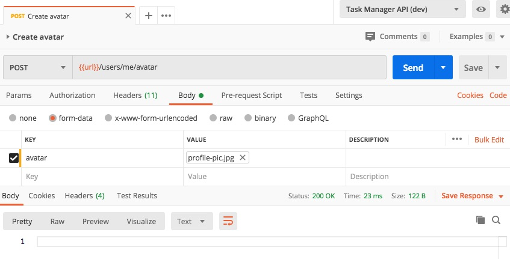

# The Complete Guide to Advanced React Component Patterns

## Table of Contents

- [The Complete Guide to Advanced React Component Patterns](#the-complete-guide-to-advanced-react-component-patterns)
  - [Table of Contents](#table-of-contents)
  - [**Section 1: Welcome**](#section-1-welcome)
  - [**Section 2: Installing and Exploring Node.js**](#section-2-installing-and-exploring-nodejs)
  - [**Section 3: Node.js Module System (Notes App)**](#section-3-nodejs-module-system-notes-app)
    <details>
    <summary>Click to view all steps</summary>
    
    - [Importing Node.js Core Modules](#importing-nodejs-core-modules)
    - [Importing Your Own Files](#importing-your-own-files)
    - [Importing npm Modules](#importing-npm-modules)
    - [Printing in Color](#printing-in-color)
    - [Global npm Modules and nodemon](#global-npm-modules-and-nodemon)
    </details>
  - [**Section 4: File System and Command Line Args (Notes App)**](#section-4-file-system-and-command-line-args-notes-app)
    <details>
    <summary>Click to view all steps</summary>

    - [Getting Input from Users](#getting-input-from-users)
    - [Argument Parsing with Yargs](#argument-parsing-with-yargs)
    - [Storing Data with JSON](#storing-data-with-json)
    - [Adding a Note](#adding-a-note)
    - [Removing a Note](#removing-a-note)
    - [ES6 Aside: Arrow Functions](#es6-aside-arrow-functions)
    - [Refactoring to Use Arrow Functions](#refactoring-to-use-arrow-functions)
    - [Reading a Note](#reading-a-note)
    </details>
  - [**Section 5: Debugging Node.js (Notes Apps)**](#section-5-debugging-nodejs-notes-apps)
    <details>
    <summary>Click to view all steps</summary>

    - [Debugging Node.js](#debugging-nodejs)
    </details>
  - [**Section 6: Asynchronous Node.js (Weather App)**](#section-6-asynchronous-nodejs-weather-app)
    <details>
    <summary>Click to view all steps</summary>

    - [Asynchronous Basics](#asynchronous-basics)
    - [Call Stack, Callback Queue, and Event Loop](#call-stack-callback-queue-and-event-loop)
    - [Making HTTP Requests](#making-http-requests)
    - [Customizing HTTP Requests](#customizing-http-requests)
    - [An HTTP Request](#an-http-request)
    - [Handling Errors](#handling-errors)
    - [The Callback Function](#the-callback-function)
    - [Callback Abstraction](#callback-abstraction)
    - [Callback Chaining](#callback-chaining)
    - [HTTP Requests Without a Library](#http-requests-without-a-library)
    </details>
  - [**Section 7: Web Servers (Weather App)**](#section-7-web-servers-weather-app)
    <details>
    <summary>Click to view all steps</summary>

    - [Hello Express](#hello-express)
    - [Serving up HTML and JSON](#serving-up-html-and-json)
    - [Serving up Static Assets](#serving-up-static-assets)
    - [Serving up CSS, JS, Images, and More](#serving-up-css-js-images-and-more)
    - [Dynamic Pages with Templating](#dynamic-pages-with-templating)
    - [Customizing the Views Directory](#customizing-the-views-directory)
    - [Advanced Templating](#advanced-templating)
    - [404 Pages](#404-pages)
    </details>
  - [**Section 8: Accessing API from Browser (Weather App)**](#section-8-accessing-api-from-browser-weather-app)
    <details>
    <summary>Click to view all steps</summary>

    - [The Query String](#the-query-string)
    - [Building a JSON HTTP Endpoint](#building-a-json-http-endpoint)
    - [ES6 Aside: Default Function Parameters](#es6-aside-default-function-parameters)
    - [Browser HTTP Requests with Fetch](#browser-http-requests-with-fetch)
    - [Creating a Search Form](#creating-a-search-form)
    - [Wiring up the User Interface](#wiring-up-the-user-interface)
    </details>
  - [**Section 9: Application Deployment (Weather App)**](#section-9-application-deployment-weather-app)
    <details>
    <summary>Click to view all steps</summary>

    - [Joining Heroku](#joining-heroku)
    - [Exploring Git](#exploring-git)
    - [Setting up SSH Keys](#setting-up-ssh-keys)
    - [Deploying Node.js to Heroku](#deploying-nodejs-to-heroku)
    </details>
  - [**Section 10: MongoDB and Promises (Task App)**](#section-10-mongodb-and-promises-task-app)
    <details>
    <summary>Click to view all steps</summary>

    - [MongoDB and NoSQL Databases](#mongodb-and-nosql-databases)
    - [Installing MongoDB on macOS and Linux](#installing-mongodb-on-macos-and-linux)
    - [Installing Database GUI Viewer](#installing-database-gui-viewer)
    - [Connecting and Inserting Documents](#connecting-and-inserting-documents)
    - [Inserting Documents](#inserting-documents)
    - [The ObjectID](#the-objectid)
    - [Querying Documents](#querying-documents)
    - [Promises](#promises)
    - [Updating Documents](#updating-documents)
    - [Deleting Documents](#deleting-documents)
    </details>
  - [**Section 11: REST APIs and Mongoose (Task App)**](#section-11-rest-apis-and-mongoose-task-app)
    <details>
    <summary>Click to view all steps</summary>

    - [Setting up Mongoose](#setting-up-mongoose)
    - [Creating a Mongoose Model](#creating-a-mongoose-model)
    - [Data Validation and Sanitization](#data-validation-and-sanitization)
    - [Structuring a REST API](#structuring-a-rest-api)
    - [Resource Creation Endpoints](#resource-creation-endpoints)
    - [Resource Reading Endpoints](#resource-reading-endpoints)
    - [Promise Chaining](#promise-chaining)
    - [Async/Await](#asyncawait)
    - [Integrating Async/Await](#integrating-asyncawait)
    - [Resource Updating Endpoints](#resource-updating-endpoints)
    - [Resource Deleting Endpoints](#resource-deleting-endpoints)
    - [Separate Route Files](#separate-route-files)
    </details>
  - [**Section 12: API Authentication and Security (Task App)**](#section-12-api-authentication-and-security-task-app)
    <details>
    <summary>Click to view all steps</summary>

    - [Securely Storing Passwords](#securely-storing-passwords)
    - [Logging in Users](#logging-in-users)
    - [JSON Web Tokens](#json-web-tokens)
    - [Generating Authentication Tokens](#generating-authentication-tokens)
    - [Express Middleware](#express-middleware)
    - [Accepting Authentication Tokens](#accepting-authentication-tokens)
    - [Advanced Postman](#advanced-postman)
    - [Logging Out](#logging-out)
    - [Hiding Private Data](#hiding-private-data)
    - [Authenticating User Endpoints](#authenticating-user-endpoints)
    - [The User/Task Relationship](#the-usertask-relationship)
    - [Authenticating Task Endpoints](#authenticating-task-endpoints)
    - [Cascade Delete Tasks](#cascade-delete-tasks)
    </details>
  - [**Section 13: Sorting, Pagination, and Filtering (Task App)**](#section-13-sorting-pagination-and-filtering-task-app)
    <details>
    <summary>Click to view all steps</summary>

    - [Working with Timestamps](#working-with-timestamps)
    - [Filtering Data](#filtering-data)
    - [Paginating Data](#paginating-data)
    - [Sorting Data](#sorting-data)
    </details>
  - [**Section 14: File Uploads (Task App)**](#section-14-file-uploads-task-app)
    <details>
    <summary>Click to view all steps</summary>

    - [Adding Support for File Uploads](#adding-support-for-file-uploads)
    - [Validating File Uploads](#validating-file-uploads)
    - [Validation Challenge](#validation-challenge)
    - [Handling Express Errors](#handling-express-errors)
    - [Adding Images to User Profile](#adding-images-to-user-profile)
    - [Serving up Files](#serving-up-files)
    - [Auto-Cropping and Image Formatting](#auto-cropping-and-image-formatting)
    </details>
  - [**Section 15: Sending Emails (Task App)**](#section-15-sending-emails-task-app)
    <details>
    <summary>Click to view all steps</summary>

    - [Exploring SendGrid](#exploring-sendgrid)
    - [Sending Welcome and Cancelation Emails](#sending-welcome-and-cancelation-emails)
    - [Environment Variables](#environment-variables)
    - [Creating a Production MongoDB Database](#creating-a-production-mongodb-database)
    </details>
  - [**Section 16: Testing Node.js (Task App)**](#section-16-testing-nodejs-task-app)
    <details>
    <summary>Click to view all steps</summary>
    
    - [Jest Testing Framework](#jest-testing-framework)
    - [Writing Tests and Assertions](#writing-tests-and-assertions)
    - [Writing Your Own Tests](#writing-your-own-tests)
    - [Testing Asynchronous Code](#testing-asynchronous-code)
    - [Testing an Express Application](#testing-an-express-application)
    - [Jest Setup and Teardown](#jest-setup-and-teardown)
    - [Testing with Authentication](#testing-with-authentication)
    - [Advanced Assertions](#advanced-assertions)
    - [Mocking Libraries](#mocking-libraries)
    - [Wrapping up User Tests](#wrapping-up-user-tests)
    - [Setup Task Test Suite](#setup-task-test-suite)
    - [Testing with Task Data](#testing-with-task-data)
    - [Extra Test Ideas](#extra-test-ideas)
    </details>
  - [**Section 17: Real-Time Web Applications with Socket.io (Chat App)**](#section-17-real-time-web-applications-with-socketio-chat-app)
    <details>
    <summary>Click to view all steps</summary>

    - [Creating the Chat App Project](#creating-the-chat-app-project)
    - [WebSockets](#websockets)
    - [Getting Started with Socket.io](#getting-started-with-socketio)
    - [Socket.io Events](#socketio-events)
    - [Broadcasting Events](#broadcasting-events)
    - [Sharing Your Location](#sharing-your-location)
    - [Event Acknowledgements](#event-acknowledgements)
    - [Form and Button States](#form-and-button-states)
    </details>
  - [**Section 18: Wrapping Up**](#section-18-wrapping-up)

## **Section 1: Welcome**

- [Complete NodeJS](complete-node-js.pdf)
- [Source Code](https://github.com/andrewjmead/node-course-v3-code)

**[⬆ back to top](#table-of-contents)**

## **Section 2: Installing and Exploring Node.js**

**[⬆ back to top](#table-of-contents)**

## **Section 3: Node.js Module System (Notes App)**

### Importing Node.js Core Modules

```javascript
const fs = require('fs')

fs.writeFileSync('notes.txt', 'My name is Chester.')
fs.appendFileSync('notes.txt', ' I live in Singapore.')
```

```console
node app.js
```

**[⬆ back to top](#table-of-contents)**

### Importing Your Own Files

[Introduction to CommonJS](https://flaviocopes.com/commonjs/)

```javascript
const getNotes = () => 'Your notes...'

module.exports = getNotes 
```

```javascript
const getNotes = require('./notes.js')
const msg = getNotes()
```

**[⬆ back to top](#table-of-contents)**

### Importing npm Modules

```console
npm init -y
npm i validator
```

```javascript
const validator = require('validator')
console.log(validator.isURL('https://mead.io/')) 
```

**[⬆ back to top](#table-of-contents)**

### Printing in Color

```console
npm i chalk
```

```javascript
const chalk = require('chalk')
const greenMsg = chalk.green.inverse.bold('Success!')
```

**[⬆ back to top](#table-of-contents)**

### Global npm Modules and nodemon

```console
npm i -g nodemon
nodemon app.js
```

**[⬆ back to top](#table-of-contents)**

## **Section 4: File System and Command Line Args (Notes App)**

### Getting Input from Users

```javascript
const command = process.argv[2]

if (command === 'add') {
  console.log('Adding note!')
} else if (command === 'remove') {
  console.log('Removing note!')
}
```

```console
node app.js add
```

**[⬆ back to top](#table-of-contents)**

### Argument Parsing with Yargs

```javascript
const yargs = require('yargs')

// Create add command
yargs.command({
  command: 'add',
  describe: 'Add a new note',
  builder: {
    title: {
      describe: 'Note title',
      demandOption: true,
      type: 'string'
    },
    body: {
      describe: 'Note body',
      demandOption: true,
      type: 'string'
    }
  },
  handler: function (argv) {
    console.log('Title: ' + argv.title)
    console.log('Body: ' + argv.body)
  }
})

// Create remove command
yargs.command({
  command: 'remove',
  describe: 'Remove a note',
  handler: function () {
      console.log('Removing the note')
  }
})

// Create list command
yargs.command({
  command: 'list',
  describe: 'List your notes',
  handler: function () {
      console.log('Listing out all notes')
  }
})

// Create read command
yargs.command({
  command: 'read',
  describe: 'Read a note',
  handler: function () {
      console.log('Reading a note')
  }
})

module.exports = yargs 
```

```javascript
const yargs = require('./yargs')
console.log(yargs.argv)
yargs.parse()
```

```console
node app.js add
node app.js remove
node app.js list
node app.js read
node app.js add --title="My Note" --body="Interesting Lesson"
```

**[⬆ back to top](#table-of-contents)**

### Storing Data with JSON

```javascript
const book = {
  title: 'Ego is the Enemy',
  author: 'Ryan Holiday'
}

const bookJSON = JSON.stringify(book)
const parseData = JSON.parse(bookJSON)
```

```json
{
  "title": "Ego is the Enemy",
  "author": "Ryan Holiday"
}
```

```javascript
// const dataBuffer = fs.readFileSync('1-json.json')
// const dataJSON = dataBuffer.toString()
// const user = JSON.parse(dataJSON)

const user = require('./1-json.json')
user.name = 'Gunther'
user.age = 54

const userJSON = JSON.stringify(user, false, 2)
fs.writeFileSync('1-json.json', userJSON)
```

```json
{
  "title": "Ego is the Enemy",
  "author": "Ryan Holiday",
  "name": "Gunther",
  "age": 54
}
```

### Adding a Note

```javascript
// app.js
const yargs = require('yargs')
const notes = require('./notes.js')

// Create add command
yargs.command({
  command: 'add',
  describe: 'Add a new note',
  builder: {
    title: {
      describe: 'Note title',
      demandOption: true,
      type: 'string'
    },
    body: {
      describe: 'Note body',
      demandOption: true,
      type: 'string'
    }
  },
  handler: function (argv) {
    notes.addNote(argv.title, argv.body)
  }
})

// Create remove command
yargs.command({
  command: 'remove',
  describe: 'Remove a note',
  handler: function () {
    console.log('Removing the note')
  }
})

// Create list command
yargs.command({
  command: 'list',
  describe: 'List your notes',
  handler: function () {
    console.log('Listing out all notes')
  }
})

// Create read command
yargs.command({
  command: 'read',
  describe: 'Read a note',
  handler: function () {
    console.log('Reading a note')
  }
})

console.log(yargs.argv)
yargs.parse()
```

```javascript
// notes.js
const fs = require('fs')
const getNotes = () => 'Your notes...'

const addNote = (title, body) => {
  const notes = loadNotes()
  const duplicateNotes = notes.filter(note => note.title === title)

  if (duplicateNotes.length === 0) {
    notes.push({
        title: title,
        body: body
    })
    saveNotes(notes)
    console.log('New note added!')
  } else {
    console.log('Note title taken!')
  }
}

const saveNotes = notes => {
  const dataJSON = JSON.stringify(notes, false, 2)
  fs.writeFileSync('notes.json', dataJSON)
}

const loadNotes = () => {
  try {
    return require('./notes.json')
  } catch (e) {
    return []
  }
}

module.exports = {
  getNotes: getNotes,
  addNote: addNote
}
```

```console
node app.js add --title="Frontend 1" --body="React"
node app.js add --title="Frontend 2" --body="Vue"
node app.js add --title="Frontend 3" --body="Angular"
```

**[⬆ back to top](#table-of-contents)**

### Removing a Note

```javascript
// notes.js
const chalk = require('chalk')
...
const removeNote = title => {
  const notes = loadNotes()
  const notesToKeep = notes.filter(function (note) {
    return note.title !== title
  })

  if (notes.length > notesToKeep.length) {
    console.log(chalk.green.inverse('Note removed!'))
    saveNotes(notesToKeep)
  } else {
    console.log(chalk.red.inverse('No note found!'))
  }    
}

module.exports = {
  getNotes,
  addNote,
  removeNote
}
```

```javascript
// app.js
const yargs = require('yargs')
const notes = require('./notes.js')
...
// Create remove command
yargs.command({
  command: 'remove',
  describe: 'Remove a note',
  builder: {
    title: {
      describe: 'Note title',
      demandOption: true,
      type: 'string'
    }
  },
  handler: function (argv) {
    notes.removeNote(argv.title)
  }
})

yargs.parse()
```

```console
node app.js add --title="Frontend 1" --body="React"
node app.js add --title="Frontend 2" --body="Vue"
node app.js add --title="Frontend 3" --body="Angular"
node app.js remove --title="Frontend 3"
```

**[⬆ back to top](#table-of-contents)**

### ES6 Aside: Arrow Functions

```javascript
const event = {
  name: 'Birthday Party',
  guestList: ['Andrew', 'Jen', 'Mike'],
  printGuestList() {
    console.log('Guest list for ' + this.name)
    this.guestList.forEach((guest) => {
      console.log(guest + ' is attending ' + this.name)
    })
  }
}
```

```javascript
//
// Goal: Create method to get incomplete tasks
//
// 1. Define getTasksToDo method
// 2. Use filter to to return just the incompleted tasks (arrow function)
// 3. Test your work by running the script

const tasks = {
  tasks: [{
    text: 'Grocery shopping',
    completed: true
  }, {
    text: 'Clean yard',
    completed: false
  }, {
    text: 'Film course',
    completed: false
  }],
  getTasksToDo() {
    return this.tasks.filter(task => task.completed === false)
  }
}
tasks.getTasksToDo()
```

**[⬆ back to top](#table-of-contents)**

### Refactoring to Use Arrow Functions

```javascript
// app.js
const yargs = require('yargs')
const notes = require('./notes.js')

// Create add command
yargs.command({
  command: 'add',
  describe: 'Add a new note',
  builder: {
    title: {
      describe: 'Note title',
      demandOption: true,
      type: 'string'
    },
    body: {
      describe: 'Note body',
      demandOption: true,
      type: 'string'
    }
  },
  handler(argv) {
    notes.addNote(argv.title, argv.body)
  }
})

// Create remove command
yargs.command({
  command: 'remove',
  describe: 'Remove a note',
  builder: {
    title: {
      describe: 'Note title',
      demandOption: true,
      type: 'string'
    }
  },
  handler(argv) {
    notes.removeNote(argv.title)
  }
})

// Create list command
yargs.command({
  command: 'list',
  describe: 'List your notes',
  handler() {
    console.log('Listing out all notes')
  }
})

// Create read command
yargs.command({
  command: 'read',
  describe: 'Read a note',
  handler() {
    console.log('Reading a note')
  }
})

console.log(yargs.argv)
yargs.parse()
```

```javascript
// notes.js
const fs = require('fs')
const chalk = require('chalk')
const getNotes = () => 'Your notes...'

const addNote = (title, body) => {
  const notes = loadNotes()
  const duplicateNotes = notes.filter(note => note.title === title)

  if (duplicateNotes.length === 0) {
    notes.push({
      title: title,
      body: body
    })
    saveNotes(notes)
    console.log(chalk.green.inverse('New note added!'))
  } else {
    console.log(chalk.red.inverse('Note title taken!'))
  }
}

const removeNote = title => {
  const notes = loadNotes()
  const notesToKeep = notes.filter(note => note.title !== title)

  if (notes.length > notesToKeep.length) {
    console.log(chalk.green.inverse('Note removed!'))
    saveNotes(notesToKeep)
  } else {
    console.log(chalk.red.inverse('No note found!'))
  }    
}

const saveNotes = notes => {
  const dataJSON = JSON.stringify(notes, false, 2)
  fs.writeFileSync('notes.json', dataJSON)
}

const loadNotes = () => {
  try {
    return require('./notes.json')
  } catch (e) {
    return []
  }
}

module.exports = {
  getNotes,
  addNote,
  removeNote
}
```

```console
node app.js add --title="Frontend 1" --body="React"
node app.js add --title="Frontend 2" --body="Vue"
node app.js add --title="Frontend 3" --body="Angular"
node app.js remove --title="Frontend 3"
```

**[⬆ back to top](#table-of-contents)**

Listing Notes

```javascript
// notes.js
const fs = require('fs')
const chalk = require('chalk')
...
const listNotes = () => {
  const notes = loadNotes()

  console.log(chalk.inverse('Your notes'))
  notes.forEach(note => console.log(note.title))
}

module.exports = {
  getNotes,
  addNote,
  removeNote,
  listNotes
}
```

```javascript
// app.js
...
// Create list command
yargs.command({
  command: 'list',
  describe: 'List your notes',
  handler() {
    notes.listNotes()
  }
})

yargs.parse()
```

```console
node app.js list
```

**[⬆ back to top](#table-of-contents)**

### Reading a Note

```javascript
// app.js
...
// Create read command
yargs.command({
  command: 'read',
  describe: 'Read a note',
  builder: {
    title: {
      describe: 'Note title',
      demandOption: true,
      type: 'string'
    }
  },
  handler(argv) {
    notes.readNote(argv.title)
  }
})

yargs.parse()
```

```javascript
// notes.js
const readNote = title => {
  const notes = loadNotes()
  const note = notes.find((note) => note.title === title)

  if (note) {
    console.log(chalk.inverse(note.title))
    console.log(note.body)
  } else {
    console.log(chalk.red.inverse('Note not found!'))
  }
}

module.exports = {
  getNotes,
  addNote,
  removeNote,
  listNotes,
  readNote
}
```

```console
node app.js read --title="Frontend 3"
```

**[⬆ back to top](#table-of-contents)**

## **Section 5: Debugging Node.js (Notes Apps)**

### Debugging Node.js

[Debugger](https://nodejs.org/api/debugger.html)

```javascript
console.log('Start debugger')
debugger
console.log('Stop debugger')
```

```console
node inspect app.js
```

Visit chrome://inspect in the Chromr browser

**[⬆ back to top](#table-of-contents)**

## **Section 6: Asynchronous Node.js (Weather App)**

- Asynchronous
- Non-blocking
- Single Threaded
- Event Driven

### Asynchronous Basics

```javascript
console.log('Starting')
setTimeout(() => console.log('2 Second Timer'), 2000)
setTimeout(() => console.log('0 Second Timer'), 0)
console.log('Stopping')
```

Starting
Stopping
0 Second Timer
2 Second Timer

**[⬆ back to top](#table-of-contents)**

### Call Stack, Callback Queue, and Event Loop

**[⬆ back to top](#table-of-contents)**

### Making HTTP Requests

- [request](https://github.com/request/request)
- [postman-request](https://github.com/postmanlabs/postman-request#readme)
- [weatherstack](https://weatherstack.com/documentation)

```javascript
require('dotenv').config()
const request = require('request')

const country = "Singapore"
const url = `http://api.weatherstack.com/current?access_key=${process.env.ACCESS_KEY}&query=${country}`

request({ url: url }, (error, response) => {
  const data = JSON.parse(response.body)
  console.log(data.current)
})
```

**[⬆ back to top](#table-of-contents)**

### Customizing HTTP Requests

[mapbox](https://www.mapbox.com/)

```javascript
require('dotenv').config()
const request = require('request')

const accessKey = process.env.WEATHER_STACK_ACCESS_KEY
const country = "Singapore"
const url = `http://api.weatherstack.com/current?access_key=${accessKey}&query=${country}`

request({ url: url, json: true }, (error, response) => {
  console.log(`${response.body.current.weather_descriptions[0]} It is currently ${response.body.current.temperature} degress out. There is a ${response.body.current.precip * 100}% chance of rain.`)
})
```

**[⬆ back to top](#table-of-contents)**

### An HTTP Request

```javascript
require('dotenv').config()
const request = require('request')

// Geocoding
// Address -> Lat/Long -> Weather
const accessToken = process.env.MAPBOX_ACCESS_TOKEN
const geocodeURL = `https://api.mapbox.com/geocoding/v5/mapbox.places/${country}.json?access_token=${accessToken}`

request({ url: geocodeURL, json: true }, (error, response) => {
  const latitude = response.body.features[0].center[0]
  const longitude = response.body.features[0].center[1]
  console.log(latitude, longitude)
}) 
```

**[⬆ back to top](#table-of-contents)**

### Handling Errors

```javascript
require('dotenv').config()
const request = require('request')

const accessKey = process.env.WEATHER_STACK_ACCESS_KEY
const country = "Singapore"
const url = `http://api.weatherstack.com/current?access_key=${accessKey}&query=${country}`

request({ url: url, json: true }, (error, response) => {
  if (error) {
    console.log('Unable to connect to weather service!')
  } else if (response.body.error) {
    console.log('Unable to find location')
  } else {
    console.log(`${response.body.current.weather_descriptions[0]} It is currently ${response.body.current.temperature} degress out. There is a ${response.body.current.precip * 100}% chance of rain.`)
  }
})

// Geocoding
// Address -> Lat/Long -> Weather

const accessToken = process.env.MAPBOX_ACCESS_TOKEN
const geocodeURL = `https://api.mapbox.com/geocoding/v5/mapbox.places/${country}.json?access_token=${accessToken}`

request({ url: geocodeURL, json: true }, (error, response) => {
  if (error){
    console.log('Unable to connect to location services!')
  }
  else if (response.body.features.length === 0) {
    console.log('Unable to find location. Try another search.')
  }
  else {
    const latitude = response.body.features[0].center[0]
    const longitude = response.body.features[0].center[1]
    console.log(latitude, longitude)
  }
}) 
```

**[⬆ back to top](#table-of-contents)**

### The Callback Function

```javascript
setTimeout(() => console.log('Two seconds are up'), 2000)

const geocode = (address, callback) =>
  setTimeout(() => callback({ latitude: 0, longitude: 0 }), 2000)
geocode('Philadelphia', data => console.log(data))

const add = (a, b, callback) => setTimeout(() => callback(a + b), 2000)
add(1, 4, sum => console.log(sum)) 
```

**[⬆ back to top](#table-of-contents)**

### Callback Abstraction

```javascript
// app.js
require('dotenv').config()
const geocode = require('./utils/geocode')
const forecast = require('./utils/forecast')

geocode('Singapore', (error, data) => {
  console.log('Error', error)
  console.log('Data', data)
})

forecast(1.3, 103.8, (error, data) => {
  console.log('Error', error)
  console.log('Data', data)
})
```

```javascript
// geocode.js
const request = require('postman-request');

const geocode = (address, callback) => {  
  const accessToken = process.env.MAPBOX_ACCESS_TOKEN
  const url = `https://api.mapbox.com/geocoding/v5/mapbox.places/${address}.json?access_token=${accessToken}`

  request({ url, json: true }, (error, response, body) => {
    if (error || response.statusCode !== 200) {
      callback('Unable to connect to location services!', undefined)
    }
    else if (body.features.length === 0) {
      callback('Unable to find location. Try another search.', undefined)
    }
    else {
      const latitude = body.features[0].center[1]
      const longitude = body.features[0].center[0]
      const location = body.features[0].place_name
      callback(undefined, { 
        latitude, 
        longitude,
        location
      })
    }
  }) 
}

module.exports = geocode
```

```javascript
// forecast.js
const request = require('postman-request');

const forecast = (latitude, longitude, callback) => {
  const accessKey = process.env.WEATHER_STACK_ACCESS_KEY
  const url = `http://api.weatherstack.com/current?access_key=${accessKey}&query=${latitude},${longitude}`

  request({ url, json: true }, (error, response, body) => {
    if (error || response.statusCode !== 200) {
      callback('Unable to connect to weather service!', undefined)
    } else if (body.error) {
      callback('Unable to find location', undefined)
    } else {
      callback(undefined, `${body.current.weather_descriptions[0]} It is currently ${body.current.temperature} degress out. There is a ${body.current.precip * 100}% chance of rain.`)
    }
  })
}

module.exports = forecast
```

**[⬆ back to top](#table-of-contents)**

### Callback Chaining

```javascript
require('dotenv').config()
const geocode = require('./utils/geocode')
const forecast = require('./utils/forecast')

const address = process.argv[2]

if (!address) {
    console.log('Please provide an address')
} else {
  geocode(address, (error, { latitude, longitude, location }) => {
    if (error) {
      return console.log(error)
    }

    forecast(latitude, longitude, (error, forecastData) => {
      if (error) {
        return console.log(error)
      }

      console.log(location)
      console.log(forecastData)
    })
  })
}
```

**[⬆ back to top](#table-of-contents)**


ES6 Aside: Object Property Shorthand and Destructuring

```javascript
// Object property shorthand
const name = 'Andrew'
const userAge = 27

const user = {
  name,
  age: userAge,
  location: 'Philadelphia'
}

// Object destructuring
const product = {
  label: 'Red notebook',
  price: 3,
  stock: 201,
  salePrice: undefined,
  rating: 4.2
}

// const label = product.label
// const stock = product.stock

const { label: productLabel, stock, rating = 5 } = product

const transaction = (type, { label, stock }) => {
  console.log(type, label, stock)
}
transaction('order', product) 
```

**[⬆ back to top](#table-of-contents)**

### HTTP Requests Without a Library

[http.request](https://nodejs.org/api/http.html#http_http_request_url_options_callback)

```javascript
require('dotenv').config()
const http = require('http')

const accessKey = process.env.WEATHER_STACK_ACCESS_KEY
const url = `http://api.weatherstack.com/current?access_key=${accessKey}&query=1.3,103.8`

const request = http.request(url, response => {
  let data = ''

  response.on('data', chunk => {
    data = data + chunk.toString()
  })

  response.on('end', () => {
    const body = JSON.parse(data)
    console.log(body)
  })
})

request.on('error', (error) => {
  console.log('An error', error)
})

request.end()
```

**[⬆ back to top](#table-of-contents)**

## **Section 7: Web Servers (Weather App)**

### Hello Express

web-server

- src


```javascript
const express = require('express')
const app = express()

app.get('', (req, res) => res.send('Hello express!'))
app.get('/help', (req, res) => res.send('Help page'))
app.get('/about', (req, res) => res.send('About'))
app.get('/weather', (req, res) => res.send('Your weather'))

app.listen(3000, () => console.log('Server is up on port 3000.'))
```

```console
nodemon src/app.js
```

**[⬆ back to top](#table-of-contents)**

### Serving up HTML and JSON

```javascript
const express = require('express')
const app = express()

// route
app.get('', (req, res) => res.send('<h1>Weather</h1>'))
app.get('/help', (req, res) => res.send([
  { name: 'Andrew' }, { name: 'Sarah'}
]))
app.get('/about', (req, res) => res.send('<h1>About</h1>'))
app.get('/weather', (req, res) => res.send({
  forecast: 'It is sunny',
  location: 'Singapore'
}))

app.listen(3000, () => console.log('Server is up on port 3000.'))
```

Chrome Browser

- http://localhost:3000
- http://localhost:3000/help
- http://localhost:3000/about
- http://localhost:3000/weather

**[⬆ back to top](#table-of-contents)**

### Serving up Static Assets

web-server

- public (exposed by the web server)
- src

```javascript
const express = require('express')
const path = require('path')

const app = express()

console.log(__dirname)
console.log(__filename)
const publicDirectoryPath = path.join(__dirname, '../public')

// html static assets
app.use(express.static(publicDirectoryPath))

// route
app.get('/weather', (req, res) => res.send({
  forecast: 'It is sunny',
  location: 'Singapore'
}))

app.listen(3000, () => console.log('Server is up on port 3000.'))
```

Chrome Browser

- http://localhost:3000
- http://localhost:3000/index.html
- http://localhost:3000/help.html
- http://localhost:3000/about.html
- http://localhost:3000/weather

**[⬆ back to top](#table-of-contents)**

### Serving up CSS, JS, Images, and More

web-server

- public (exposed by the web server)
  - css
  - img
- src

**[⬆ back to top](#table-of-contents)**

### Dynamic Pages with Templating

[hbs](https://github.com/pillarjs/hbs)

web-server

- public (exposed by the web server)
  - css
  - img
- src
- views (contains .hbs files)

```javascript
// app.js
const express = require('express')
const path = require('path')

const app = express()

const publicDirectoryPath = path.join(__dirname, '../public')
app.use(express.static(publicDirectoryPath))

app.set('view engine', 'hbs')

app.get('', (req, res) => {
  res.render('index', {
    title: 'Weather',
    name: 'Andrew Mead'
  })
})

app.get('/about', (req, res) => {
  res.render('about', {
    title: 'About Me',
    name: 'Andrew Mead'
  })
})

app.get('/help', (req, res) => {
  res.render('help', {
    helpText: 'This is some helpful text.'
  })
})

app.get('/weather', (req, res) => res.send({
  forecast: 'It is sunny',
  location: 'Singapore'
}))

app.listen(3000, () => console.log('Server is up on port 3000.'))
```

```html
<!-- index.hbs -->
<!DOCTYPE html>

<html>

<head>
  <link rel="stylesheet" href="/css/styles.css">
</head>

<body>
  <h1>{{title}}</h1>
  <p>Created by {{name}}</p>
</body>

</html> 
```

**[⬆ back to top](#table-of-contents)**

### Customizing the Views Directory

web-server

- public (exposed by the web server)
  - css
  - img
- src
- templates (contains .hbs files)

```javascript
const express = require('express')
const path = require('path')

const app = express()

// Define paths for Express config
const publicDirectoryPath = path.join(__dirname, '../public')
const viewsPath = path.join(__dirname, '../templates')

// Setup handlebars engine and views location
app.set('view engine', 'hbs')
app.set('views', viewsPath)

// Setup static directory to serve
app.use(express.static(publicDirectoryPath))

app.get('', (req, res) => {
  res.render('index', {
    title: 'Weather',
    name: 'Andrew Mead'
  })
})

app.get('/about', (req, res) => {
  res.render('about', {
    title: 'About Me',
    name: 'Andrew Mead'
  })
})

app.get('/help', (req, res) => {
  res.render('help', {
    helpText: 'This is some helpful text.'
  })
})

app.get('/weather', (req, res) => res.send({
  forecast: 'It is sunny',
  location: 'Singapore'
}))

app.listen(3000, () => console.log('Server is up on port 3000.'))
```

**[⬆ back to top](#table-of-contents)**

### Advanced Templating

web-server

- public (exposed by the web server)
  - css
  - img
- src
- templates (contains .hbs files)
  - partials
  - views

```javascript
const express = require('express')
const path = require('path')
const hbs = require('hbs')

const app = express()

// Define paths for Express config
const publicDirectoryPath = path.join(__dirname, '../public')
const viewsPath = path.join(__dirname, '../templates/views')
const partialsPath = path.join(__dirname, '../templates/partials')

// Setup handlebars engine and views location
app.set('view engine', 'hbs')
app.set('views', viewsPath)
hbs.registerPartials(partialsPath)

// Setup static directory to serve
app.use(express.static(publicDirectoryPath))

app.get('', (req, res) => {
  res.render('index', {
    title: 'Weather',
    name: 'Andrew Mead'
  })
})

app.get('/about', (req, res) => {
  res.render('about', {
    title: 'About Me',
    name: 'Andrew Mead'
  })
})

app.get('/help', (req, res) => {
  res.render('help', {
    helpText: 'This is some helpful text.',
    title: 'Help',
    name: 'Andrew Mead'
  })
})

app.get('/weather', (req, res) => res.send({
  forecast: 'It is sunny',
  location: 'Singapore'
}))

app.listen(3000, () => console.log('Server is up on port 3000.'))
```

```hbs
<!-- partials/header.hbs -->
<h1>{{title}}</h1>

<div>
  <a href="/">Weather</a>
  <a href="/about">About</a>
  <a href="/help">Help</a>
</div>
```

```hbs
<!-- partials/footer.hbs -->
<p>Created by {{name}}</p> 
```

```hbs
<!-- views/index.hbs -->
<!DOCTYPE html>

<html>

<head>
  <link rel="stylesheet" href="/css/styles.css">
</head>

<body>
  {{>header}}
  {{>footer}}
</body>

</html> 
```

**[⬆ back to top](#table-of-contents)**

### 404 Pages

```javascript
...
app.get('/help/*', (req, res) => {
  res.render('404', {
    title: '404',
    name: 'Andrew Mead',
    errorMessage: 'Help article not found.'
  })
})

app.get('*', (req, res) => {
  res.render('404', {
    title: '404',
    name: 'Andrew Mead',
    errorMessage: 'Page not found.'
  })
})

app.listen(3000, () => console.log('Server is up on port 3000.'))
```

```hbs
<!-- views/404.hbs -->
<!DOCTYPE html>

<html>

<head>
  <link rel="stylesheet" href="/css/styles.css">
</head>

<body>
  {{>header}}
  <p>{{errorMessage}}</p>
  {{>footer}}
</body>

</html> 
```

**[⬆ back to top](#table-of-contents)**

## **Section 8: Accessing API from Browser (Weather App)**

### The Query String

```javascript
// app.js
...
app.get('/weather', (req, res) => {
  if (!req.query.address) {
    return res.send({
      error: 'You must provide an address!'
    })
  }
  
  res.send({
    forecast: 'It is sunny',
    location: 'Singapore',
    address: req.query.address
  })
})

app.get('/products', (req, res) => {
  if (!req.query.search) {
    return res.send({
      error: 'You must provide a search term'
    })
  }
  
  res.send({
    products: []
  })
})
```

Chrome Browser

- http://localhost:3000/weather?address=Singapore
- http://localhost:3000/products?search=games

**[⬆ back to top](#table-of-contents)**

### Building a JSON HTTP Endpoint

```javascript
// app.js
...
app.get('/weather', (req, res) => {
  if (!req.query.address) {
    return res.send({
      error: 'You must provide an address!'
    })
  }
  
  geocode(req.query.address, (error, { latitude, longitude, location }) => {
    if (error) {
      return res.send({ error })
    }

    forecast(latitude, longitude, (error, forecastData) => {
      if (error) {
        return res.send({ error })
      }

      res.send({
        forecast: forecastData,
        location,
        address: req.query.address
      })
    })
  })
})
```

**[⬆ back to top](#table-of-contents)**

### ES6 Aside: Default Function Parameters

```javascript
// app.js
geocode(req.query.address, (error, { latitude, longitude, location } = {}) => {
    ...
  })
})
```

**[⬆ back to top](#table-of-contents)**

### Browser HTTP Requests with Fetch

web-server

- public (exposed by the web server)
  - css
  - img
  - js (make http request from frontend)
- src
- templates (contains .hbs files)
  - partials
  - views

```hbs
<!DOCTYPE html>

<html>

<head>
  <title>Weather</title>
  <link rel="icon" href="/img/weather.png">
  <link rel="stylesheet" href="/css/styles.css">
  <script src="/js/app.js"></script>
</head>

<body>
  <div class="main-content">
    {{>header}}
    <p>Use this site to get your weather!</p>
  </div>
  
  {{>footer}}
</body>

</html> 
```

```javascript
// public/js/app.js
console.log('Client side javascript file is loaded!')

fetch('http://localhost:3000/weather?address=!').then(response => {
  response.json().then((data) => {
    if (data.error) {
      console.log(data.error)
    } else {
      console.log(data.location)
      console.log(data.forecast)
    }
  })
})
```

**[⬆ back to top](#table-of-contents)**

### Creating a Search Form

```hbs
<!-- index.hbs -->
<!DOCTYPE html>

<html>

<head>
  <title>Weather</title>
  <link rel="icon" href="/img/weather.png">
  <link rel="stylesheet" href="/css/styles.css">
</head>

<body>
  <div class="main-content">
    {{>header}}
    <p>Use this site to get your weather!</p>

    <form>
      <input placeholder="Location">
      <button>Search</button>
    </form>
  </div>
  
  {{>footer}}
  <script src="/js/app.js"></script>
</body>

</html> 
```

```javascript
// public/js/app.js
console.log('Client side javascript file is loaded!')

const weatherForm = document.querySelector('form')
const search = document.querySelector('input')

weatherForm.addEventListener('submit', event => {
  event.preventDefault()
  const location = search.value
  fetch(`http://localhost:3000/weather?address=${location}`)
    .then(response => {
      response.json().then((data) => {
        if (data.error) {
          console.log(data.error)
        } else {
          console.log(data.location)
          console.log(data.forecast)
        }
      })
    })
})
```

**[⬆ back to top](#table-of-contents)**

### Wiring up the User Interface

```javascript
// public/js/app.js
console.log('Client side javascript file is loaded!')

const weatherForm = document.querySelector('form')
const search = document.querySelector('input')
const messageOne = document.querySelector('#message-1')
const messageTwo = document.querySelector('#message-2')

weatherForm.addEventListener('submit', event => {

  event.preventDefault()
  const location = search.value

  messageOne.textContent = 'Loading...'
  messageTwo.textContent = ''

  fetch(`http://localhost:3000/weather?address=${location}`)
    .then(response => {
      response.json().then((data) => {
        if (data.error) {
          messageOne.textContent = data.error
        } else {
          messageOne.textContent = data.location
          messageTwo.textContent = data.forecast
        }
      })
    })
})
```

```hbs
<!DOCTYPE html>

<html>

<head>
  <title>Weather</title>
  <link rel="icon" href="/img/weather.png">
  <link rel="stylesheet" href="/css/styles.css">
</head>

<body>
  <div class="main-content">
    {{>header}}
    <p>Use this site to get your weather!</p>

    <form>
      <input placeholder="Location">
      <button>Search</button>
    </form>

    <p id="message-1"></p>
    <p id="message-2"></p>
  </div>
  
  {{>footer}}
  <script src="/js/app.js"></script>
</body>

</html> 
```

**[⬆ back to top](#table-of-contents)**

## **Section 9: Application Deployment (Weather App)**

### Joining Heroku

[Heroku: Cloud Application Platform](https://www.heroku.com/)

```console
heroku -v
heroku login
heroku logs
```

**[⬆ back to top](#table-of-contents)**

### Exploring Git

Version Control with Git

| Untracked Files | Unstaged Changes | Staged Changes | Commits |
| --------------- | ---------------- | -------------- | ------- |
| src/app.js      |                  |                |         |
| readme.md       |                  |                |         |

add command

| Untracked Files | Unstaged Changes | Staged Changes | Commits |
| --------------- | ---------------- | -------------- | ------- |
| readme.md       |                  | src/app.js     |         |

commit

| Untracked Files | Unstaged Changes | Staged Changes | Commits |
| --------------- | ---------------- | -------------- | ------- |
| readme.md       |                  |                |         |
|                 |                  |                | 1ab49   |

add new file geocode.js
modify src/app.js

| Untracked Files      | Unstaged Changes | Staged Changes | Commits |
| -------------------- | ---------------- | -------------- | ------- |
| readme.md            | src/app.js       |                |         |
| src/utils/geocode.js |                  |                |         |
|                      |                  |                | 1ab49   |

add command

| Untracked Files | Unstaged Changes | Staged Changes       | Commits |
| --------------- | ---------------- | -------------------- | ------- |
| readme.md       |                  | src/app.js           |         |
|                 |                  | src/utils/geocode.js |         |
|                 |                  |                      | 1ab49   |

commit

| Untracked Files | Unstaged Changes | Staged Changes | Commits |
| --------------- | ---------------- | -------------- | ------- |
| readme.md       |                  |                |         |
|                 |                  |                | e9f21   |
|                 |                  |                | 1ab49   |

**[⬆ back to top](#table-of-contents)**

### Setting up SSH Keys

```console
<!-- check for rsa key pairs -->
ls -a -l ~/.ssh

<!-- create new rsa key pairs with comment -->
ssh-keygen -t rsa -b 4096 -C "xxx@gmail.com"

<!-- list newly created rsa key pairs  -->
ls -a -l ~/.ssh
-rw-------    1 xxx  staff  3389 Jun 11 18:21 id_rsa
-rw-r--r--    1 xxx  staff   748 Jun 11 18:21 id_rsa.pub

<!-- check SSH authentication agent id -->
<!-- make sure ssh is running   -->
eval "$(ssh-agent -s)"

<!-- adding SSH private keys into the SSH authentication agent -->
ssh-add -K ~/.ssh/id_rsa
```

**[⬆ back to top](#table-of-contents)**

### Deploying Node.js to Heroku

```console
<!-- add id_rsa keys to heroku -->
heroku keys:add

<!-- create new heroku app from web-server directory -->
heroku create chester-weather-app
```

https://chester-weather-app.herokuapp.com/
https://git.heroku.com/chester-weather-app.git

```json
// package.json
{
  "name": "web-server",
  "version": "1.0.0",
  "description": "",
  "main": "index.js",
  "scripts": {
    "start": "node src/app.js"
  },
  ...
  }
}
```

```javascript
// src/app.js
...
const port = process.env.PORT || 3000
...
app.listen(port, () => console.log(`Server is up on port ${port}.`))
```

```javascript
// public/js/app.js
  fetch(`/weather?address=${location}`)
    ...
})
```

```console
git init
heroku git:remote -a chester-weather-app
git add .
git commit -m "weather-app"
git push heroku master
```

[Configuration and Config Vars](https://devcenter.heroku.com/articles/config-vars)

**[⬆ back to top](#table-of-contents)**

## **Section 10: MongoDB and Promises (Task App)**

### MongoDB and NoSQL Databases

| SQL(Structure Query Language) | NoSQL (Not Only SQL) |
| ----------------------------- | -------------------- |
| Database                      | Database             |
| Table                         | Collection           |
| Row / Record                  | Document             |
| Column                        | Field                |

**[⬆ back to top](#table-of-contents)**

### Installing MongoDB on macOS and Linux

[mongodb](https://www.mongodb.com/try/download/community)

user directory

- mongodb (app)
- mongodb-data

```console
<!-- run mondodb -->
cd ~
pwd
/Users/chesterheng/mongodb/bin/mongod --dbpath=/Users/chesterheng/mongodb-data
```

**[⬆ back to top](#table-of-contents)**

### Installing Database GUI Viewer

[Download Robo 3T](https://robomongo.org/download)

Right click connection > Open Shell

```console
db.version()
```

**[⬆ back to top](#table-of-contents)**

### Connecting and Inserting Documents

- [MongoDB Node.JS Driver](https://mongodb.github.io/node-mongodb-native/)
- [MongoDB Node.JS Driver Github](https://github.com/mongodb/node-mongodb-native)

```javascript
// CRUD create read update delete

const MongoClient = require('mongodb').MongoClient;
const connectionURL = 'mongodb://127.0.0.1:27017'
const databaseName = 'task-manager'

MongoClient.connect(connectionURL, {
  useNewUrlParser: true,   
  useUnifiedTopology: true 
},
(error, client) => {
  if (error) {
    return console.log('Unable to connect to database!')
  }

  const db = client.db(databaseName)
  db.collection('users').insertOne({
    name: 'Andrew',
    age: 27
  })
})
```

**[⬆ back to top](#table-of-contents)**

### Inserting Documents

```javascript
  db.collection('users').insertOne({
    name: 'Andrew',
    age: 27
  }, (error, result) => {
    if (error) {
      return console.log('Unable to insert user')
    }
    console.log(result.ops)
  })

  db.collection('users').insertMany([
    {
      name: 'Jen',
      age: 28
    }, {
      name: 'Gunther',
      age: 27
  }], (error, result) => {
    if (error) {
      return console.log('Unable to insert documents!')
    }
    console.log(result.ops)
  })
```

**[⬆ back to top](#table-of-contents)**

### The ObjectID

```javascript
const id = new ObjectID()
// <Buffer 5e e2 a3 3f be d3 08 11 82 e8 22 7d>
console.log(id.id)
console.log(id.id.length)

// 5ee2a33fbed3081182e8227d
console.log(id.toHexString())
console.log(id.toHexString().length)
```

**[⬆ back to top](#table-of-contents)**

### Querying Documents

```javascript
  db.collection('users')
    .findOne({ _id: new ObjectID("5ee24aeb128f4d0ade868959") }
    , (error, user) => {
      if (error) {
        return console.log('Unable to fetch')
      }
      console.log(user)
    })

  db.collection('users')
    .find({ age: 27 })
    .toArray((error, user) => {
      if (error) {
        return console.log('Unable to fetch')
      }
      console.log(user)
    })
```

### Promises

```javascript
const doWorkPromise = new Promise((resolve, reject) => {
  setTimeout(() => {
    resolve([7, 4, 1])
    // reject('Things went wrong!')
  }, 2000)
})

doWorkPromise.then(result => {
  console.log('Success!', result)
}).catch((error) => {
  console.log('Error!', error)
})

//
//                               fulfilled
//                              /
// Promise      -- pending --> 
//                              \
//                               rejected
//
```

**[⬆ back to top](#table-of-contents)**

### Updating Documents

```javascript
  db.collection('users')
    .updateOne({ _id: new ObjectID("5ee24aeb128f4d0ade868959") }, { $inc: { age: 1 } })
    .then(result => console.log(result.modifiedCount))
    .catch(error => console.log(error))

  db.collection('tasks')
    .updateMany({ completed: false }, { $set: { completed: true } })
    .then(result => console.log(result.modifiedCount))
    .catch(error => console.log(error))
```

**[⬆ back to top](#table-of-contents)**

### Deleting Documents

```javascript
db.collection('users')
  .deleteMany({ age: 27 })
  .then(result => console.log(result))
  .catch(error => console.log(error))

db.collection('tasks')
  .deleteOne({ description: "Clean the house" })
  .then(result => console.log(result))
  .catch(error => console.log(error))
```

**[⬆ back to top](#table-of-contents)**

## **Section 11: REST APIs and Mongoose (Task App)**

### Setting up Mongoose

```javascript
const mongoose = require('mongoose')

mongoose.connect('mongodb://127.0.0.1:27017/task-manager-api', {
  useNewUrlParser: true,
  useCreateIndex: true,
  useUnifiedTopology: true
})

const User = mongoose.model('User', {
  name: {
    type: String
  },
  age: {
    type: Number
  }
})

const me = new User({
  name: 'Andrew',
  age: 27
})

me.save().then(() => {
  console.log(me)
}).catch((error) => {
  console.log('Error!', error)
}) 
```

**[⬆ back to top](#table-of-contents)**

### Creating a Mongoose Model

```javascript
const Task = mongoose.model('Task', {
  description: { type: String },
  completed: { type: Boolean }
})

const task = new Task({
  description: 'Learn the Mongoose library',
  completed: false
})

task
  .save()
  .then(() => console.log(task))
  .catch((error) => console.log('Error!', error)) 
```

**[⬆ back to top](#table-of-contents)**

### Data Validation and Sanitization

[validator.js](https://github.com/validatorjs/validator.js)

```javascript
// src/models/user.js
const mongoose = require('mongoose')
const validator = require('validator')

const User = mongoose.model('User', {
  name: {
    type: String,
    required: true,
    trim: true
  },
  email: {
    type: String,
    required: true,
    trim: true,
    lowercase: true,
    validate(value) {
      if (!validator.isEmail(value)) {
          throw new Error('Email is invalid')
      }
    }
  },
  password: {
    type: String,
    required: true,
    minlength: 7,
    trim: true,
    validate(value) {
      if (value.toLowerCase().includes('password')) {
          throw new Error('Password cannot contain "password"')
      }
    }
  },
  age: {
    type: Number,
    default: 0,
    validate(value) {
      if (value < 0) {
          throw new Error('Age must be a postive number')
      }
    }
  }
})

module.exports = User
```

```javascript
// src/models/task.js
const mongoose = require('mongoose')

const Task = mongoose.model('Task', {
    description: {
        type: String,
        required: true,
        trim: true
    },
    completed: {
        type: Boolean,
        default: false
    }
})

module.exports = Task
```

### Structuring a REST API

REST API or RESTful API

- REST API: allows clients to access and manipulate resources using a set of predefined operations
  - resource: a user or a task
  - predefined operation
    - create a new task
    - mark a task as complete
- REST: Representational State Transfer
  - Representational of resource
  - State Transfer: stateless 
    - transfer from server to the client)
- API: Application Programming Interface
  - a set of tools to build application

Task Resource

- Create: POST /tasks
- Read: GET /tasks
- Read: GET /tasks/:id
- Update: PATCH /tasks/:id
- Delete: DELETE /tasks/:id

Request

- POST /tasks HTTP/1.1
- Accept: application/json
- Connection: Keep-Alive
- Authorization: Bearer ey...
- { "descroption": "Learn Node JS" }

Response

- HTTP/1.1 201 Created
- Date: Sun, 28 Jul 2020 15:37:37 GMT
- Server: Express
- Content-Type: application/json
- { "_id": "...", "descroption": "Learn Node JS" }

**[⬆ back to top](#table-of-contents)**

### Resource Creation Endpoints

```javascript
// src/index.js
const express = require('express')
require('./db/mongoose')
const User = require('./models/user')
const Task = require('./models/task')

const app = express()
const port = process.env.PORT || 3000

app.use(express.json())

app.post('/users', (req, res) => {
  const user = new User(req.body)

  user
    .save()
    .then(() => res.status(201).send(user))
    .catch(error => res.status(400).send(error))
})

app.post('/tasks', (req, res) => {
  const task = new Task(req.body)
  task
    .save()
    .then(() => res.status(201).send(task))
    .catch(error => res.status(400).send(error))
})

app.listen(port, () => console.log(`Server is up on port ${port}`))
```

**[⬆ back to top](#table-of-contents)**

### Resource Reading Endpoints

```javascript
app.get('/users', (req, res) => {
  User
    .find({})
    .then(users => res.send(users))
    .catch(error => res.status(500).send())
})

app.get('/users/:id', (req, res) => {
  const _id = req.params.id
  User
    .findById(_id)
    .then(user => {
      if (!user) {
        return res.status(404).send()
      }
      res.send(user)
    })
    .catch(error => res.status(500).send())
})

app.get('/tasks', (req, res) => {
  Task
    .find({})
    .then(tasks => res.send(tasks))
    .catch(error => res.status(500).send())
})

app.get('/tasks/:id', (req, res) => {
  const _id = req.params.id

  Task
    .findById(_id)
    .then(task => {
      if (!task) {
        return res.status(404).send()
      }
      res.send(task)
    })
    .catch(error => res.status(500).send())
})
```

**[⬆ back to top](#table-of-contents)**

### Promise Chaining

```javascript
const add = (a, b) => {
  new Promise((resolve, reject) => {
    setTimeout(() => resolve(a + b), 2000)
  })
}

add(1, 1)
  .then(sum => add(sum, 4))
  .then((sum2) => console.log(sum2))
  .catch(error => console.log(error))
```

### Async/Await

```javascript
const add = (a, b) => {
  return new Promise((resolve, reject) => {
    setTimeout(() => {
      if (a < 0 || b < 0) {
        return reject('Numbers must be non-negative')
      }
      resolve(a + b)
    }, 2000)
  })
}

const doWork = async () => {
  const sum = await add(1, -99)
  const sum2 = await add(sum, 50)
  const sum3 = await add(sum2, -3)
  return sum3
}

doWork()
  .then(result => console.log('result', result))
  .catch(error => console.log('error', error))
```

**[⬆ back to top](#table-of-contents)**

### Integrating Async/Await

```javascript
app.post('/users', async (req, res) => {
  const user = new User(req.body)

  try {
    await user.save()
    res.status(201).send(user)
  } catch (error) {
    res.status(400).send(error)
  }
})

app.get('/users', async(req, res) => {
  try {
    const users = await User.find({})
    res.send(users)
  } catch (error) {
    res.status(500).send()
  }
})

app.get('/users/:id', (req, res) => {
  const _id = req.params.id
  try {
    const user = await User.findById(_id)
    if (!user) {
        return res.status(404).send()
    }
    res.send(user)
  } catch (error) {
    res.status(500).send()
  }
})

app.post('/tasks', (req, res) => {
  const task = new Task(req.body)
  try {
    task.save()
    res.status(201).send(task)
  } catch (error) {
    res.status(400).send(error)
  }
})

app.get('/tasks', (req, res) => {
  try {
    const tasks = Task.find({})
    res.send(tasks)
  } catch (error) {
    res.status(500).send()
  }
})

app.get('/tasks/:id', (req, res) => {
  const _id = req.params.id

  try {
    const task = Task.findById(_id)
    if (!task) {
        return res.status(404).send()
    }
    res.send(task)
  } catch (error) {
    res.status(500).send()
  }
})
```

**[⬆ back to top](#table-of-contents)**

### Resource Updating Endpoints

```javascript

app.patch('/users/:id', async (req, res) => {
  const updates = Object.keys(req.body)
  const allowedUpdates = ['name', 'email', 'password', 'age']
  const isValidOperation = updates.every(update => allowedUpdates.includes(update))

  if (!isValidOperation) {
    return res.status(400).send({ error: 'Invalid updates!' })
  }

  try {
    const user = await User.findByIdAndUpdate(req.params.id, req.body, { new: true, runValidators: true })

    if (!user) {
      return res.status(404).send()
    }

    res.send(user)
  } catch (error) {
    res.status(400).send(error)
  }
})

app.patch('/tasks/:id', async (req, res) => {
  const updates = Object.keys(req.body)
  const allowedUpdates = ['description', 'completed']
  const isValidOperation = updates.every(update => allowedUpdates.includes(update))

  if (!isValidOperation) {
    return res.status(400).send({ error: 'Invalid updates!' })
  }

  try {
    const task = await Task.findByIdAndUpdate(req.params.id, req.body, { new: true, runValidators: true})

    if (!task) {
      return res.status(404).send()
    }

    res.send(task)
  } catch (error) {
    res.status(400).send(error)
  }
})
```

**[⬆ back to top](#table-of-contents)**

### Resource Deleting Endpoints

```javascript
app.delete('/users/:id', async (req, res) => {
  try {
    const user = await User.findByIdAndDelete(req.params.id)

    if (!user) {
      return res.status(404).send()
    }

    res.send(user)
  } catch (error) {
    res.status(500).send()
  }
})

app.delete('/tasks/:id', async (req, res) => {
  try {
    const task = await Task.findByIdAndDelete(req.params.id)

    if (!task) {
      res.status(404).send()
    }

    res.send(task)
  } catch (error) {
    res.status(500).send()
  }
})
```

**[⬆ back to top](#table-of-contents)**

### Separate Route Files

task-manager

- src
  - db
  - models
  - routers

```javascript
// src/index.js
const express = require('express')
require('./db/mongoose')
const userRouter = require('./routers/user')
const taskRouter = require('./routers/task')

const app = express()
const port = process.env.PORT || 3000

app.use(express.json())
app.use(userRouter)
app.use(taskRouter)

app.listen(port, () => console.log(`Server is up on port ${port}`))
```

```javascript
// src/routers/task.js
const express = require('express')
const Task = require('../models/task')
const router = new express.Router()

router.post('/tasks', async (req, res) => { ... })
router.get('/tasks', async (req, res) => { ... })
router.get('/tasks/:id', async (req, res) => { ... })
router.patch('/tasks/:id', async (req, res) => { ... })
router.delete('/tasks/:id', async (req, res) => { ... })

module.exports = router
```

```javascript
// src/routers/user.js
const express = require('express')
const User = require('../models/user')
const router = new express.Router()

router.post('/users', async (req, res) => { ... })
router.get('/users', async (req, res) => { ... })
router.get('/users/:id', async (req, res) => { ... })
router.patch('/users/:id', async (req, res) => { ... })
router.delete('/users/:id', async (req, res) => { ... })

module.exports = router
```

**[⬆ back to top](#table-of-contents)**

## **Section 12: API Authentication and Security (Task App)**

### Securely Storing Passwords

```javascript
const bcrypt = require('bcryptjs')

const myFunction = async () => {
  const password = 'Red12345!'
  const hashedPassword = await bcrypt.hash(password, 8)

  console.log(password)
  console.log(hashedPassword)

  const isMatch = await bcrypt.compare('red12345!', hashedPassword)
  console.log(isMatch)
}

myFunction()
```

```javascript
// src/models/user.js
const mongoose = require('mongoose')
const validator = require('validator')
const bcrypt = require('bcryptjs')

const userSchema = new mongoose.Schema({
  name: {
    type: String,
    required: true,
    trim: true
  },
  email: {
    type: String,
    required: true,
    trim: true,
    lowercase: true,
    validate(value) {
      if (!validator.isEmail(value)) {
        throw new Error('Email is invalid')
      }
    }
  },
  password: {
    type: String,
    required: true,
    minlength: 7,
    trim: true,
    validate(value) {
      if (value.toLowerCase().includes('password')) {
        throw new Error('Password cannot contain "password"')
      }
    }
  },
  age: {
    type: Number,
    default: 0,
    validate(value) {
      if (value < 0) {
        throw new Error('Age must be a postive number')
      }
    }
  }
})

// Hash the plain text password before saving
userSchema.pre('save', async function (next) {
  const user = this

  if (user.isModified('password')) {
    user.password = await bcrypt.hash(user.password, 8)
  }

  next()
})

const User = mongoose.model('User', userSchema)

module.exports = User
```

```javascript
router.patch('/users/:id', async (req, res) => {
  const updates = Object.keys(req.body)
  const allowedUpdates = ['name', 'email', 'password', 'age']
  const isValidOperation = updates.every(update => allowedUpdates.includes(update))

  if (!isValidOperation) {
    return res.status(400).send({ error: 'Invalid updates!' })
  }

  try {
    const user = await User.findById(req.params.id)
    updates.forEach(update => user[update] = req.body[update])
    await user.save()

    if (!user) {
      return res.status(404).send()
    }

    res.send(user)
  } catch (e) {
    res.status(400).send(e)
  }
})
```

**[⬆ back to top](#table-of-contents)**

### Logging in Users

```javascript
// src/models/user.js
userSchema.statics.findByCredentials = async (email, password) => {
  const user = await User.findOne({ email })

  if (!user) {
    throw new Error('Unable to login')
  }

  const isMatch = await bcrypt.compare(password, user.password)

  if (!isMatch) {
    throw new Error('Unable to login')
  }

  return user
}
```

```javascript
// src/routers/user.js
router.post('/users/login', async (req, res) => {
  try {
    const user = await User.findByCredentials(req.body.email, req.body.password)
    res.send(user)
  } catch (e) {
    res.status(400).send()
  }
})
```

**[⬆ back to top](#table-of-contents)**

### JSON Web Tokens

```javascript
const jwt = require('jsonwebtoken')

const myFunction = async () => {
  const token = jwt.sign({ _id: 'abc123' }, 'thisismynewcourse', { expiresIn: '7 days' })
  
  const data = jwt.verify(token, 'thisismynewcourse')
}

myFunction()
```

**[⬆ back to top](#table-of-contents)**

### Generating Authentication Tokens

```javascript
// src/models/user.js
const userSchema = new mongoose.Schema({
  name: { ... },
  email: { ... },
  password: { ... },
  age: { ... },
  tokens: [{
    token: {
        type: String,
        required: true
    }
  }]
})

userSchema.methods.generateAuthToken = async function () {
  const user = this
  const token = jwt.sign({ _id: user._id.toString() }, 'thisismynewcourse')
  user.tokens = user.tokens.concat({ token })
  await user.save()

  return token
}
```

```javascript
// src/routers/user.js
router.post('/users', async (req, res) => {
  const user = new User(req.body)

  try {
    await user.save()
    const token = await user.generateAuthToken()
    res.status(201).send({ user, token })
  } catch (error) {
    res.status(400).send(error)
  }
})

router.post('/users/login', async (req, res) => {
  try {
    const user = await User.findByCredentials(req.body.email, req.body.password)
    const token = await user.generateAuthToken()
    res.send({ user, token })
  } catch (error) {
    res.status(400).send()
  }
})
```

**[⬆ back to top](#table-of-contents)**

### Express Middleware

- without middleware: new request -> run route handler
- with middleware: new request -> do something -> run route handler

```javascript
app.use((req, res, next) => {
  if (req.method === 'GET') {
    res.send('GET requests are disabled')
  } else {
    next()
  }
})
```

```javascript
app.use((req, res, next) => {
  res.status(503).send('Site is currently down. Check back soon!')
})
```

**[⬆ back to top](#table-of-contents)**

### Accepting Authentication Tokens

Authorization: <type> <token>

```javascript
// src/middleware/auth.js
const jwt = require('jsonwebtoken')
const User = require('../models/user')

const auth = async (req, res, next) => {
  try {
    const token = req.header('Authorization').replace('Bearer ', '')
    const decoded = jwt.verify(token, 'thisismynewcourse')
    const user = await User.findOne({ _id: decoded._id, 'tokens.token': token })

    if (!user) {
      throw new Error()
    }

    req.user = user
    next()
  } catch (error) {
    res.status(401).send({ error: 'Please authenticate.' })
  }
}

module.exports = auth
```

```javascript
router.get('/users/me', auth, async (req, res) => {
  res.send(req.user)
})
```

**[⬆ back to top](#table-of-contents)**

### Advanced Postman

[Managing environments](https://learning.postman.com/docs/postman/variables-and-environments/managing-environments/)




```javascript
// Login User - Tests
if (pm.response.code === 200) {
    pm.environment.set('authToken',pm.response.json().token)
}

// Create User - Tests
if (pm.response.code === 201) {
    pm.environment.set('authToken',pm.response.json().token)
}
```

**[⬆ back to top](#table-of-contents)**

### Logging Out

```javascript
router.post('/users/logout', auth, async (req, res) => {
  try {
    req.user.tokens = 
      req.user.tokens.filter(token => token.token !== req.token)
    await req.user.save()

    res.send()
  } catch (error) {
    res.status(500).send()
  }
})

router.post('/users/logoutAll', auth, async (req, res) => {
  try {
    req.user.tokens = []
    await req.user.save()
    res.send()
  } catch (error) {
    res.status(500).send()
  }
})
```

```javascript
const jwt = require('jsonwebtoken')
const User = require('../models/user')

const auth = async (req, res, next) => {
  try {
    const token = req.header('Authorization').replace('Bearer ', '')
    const decoded = jwt.verify(token, 'thisismynewcourse')
    const user = await User.findOne({ _id: decoded._id, 'tokens.token': token })

    if (!user) {
      throw new Error()
    }
    
    req.token = token
    req.user = user
    next()
  } catch (error) {
    res.status(401).send({ error: 'Please authenticate.' })
  }
}

module.exports = auth
```

**[⬆ back to top](#table-of-contents)**

### Hiding Private Data

```javascript
const user = {
  name: "Freddie Phillips"
}

user.toJSON = function () {
  this.email = "freddie.phillips@example.com"
  return this
}

JSON.stringify(user)
```

```javascript
userSchema.methods.toJSON = function () {
  const user = this
  console.log(user)
  const userObject = user.toObject()

  delete userObject.password
  delete userObject.tokens

  return userObject
}
```

**[⬆ back to top](#table-of-contents)**

### Authenticating User Endpoints

req (from auth middleware)
  - user
  - token

```javascript
router.patch('/users/me', auth, async (req, res) => {
  const updates = Object.keys(req.body)
  const allowedUpdates = ['name', 'email', 'password', 'age']
  const isValidOperation = updates.every(update => allowedUpdates.includes(update))

  if (!isValidOperation) {
    return res.status(400).send({ error: 'Invalid updates!' })
  }

  try {
    updates.forEach(update => 
      req.user[update] = req.body[update])
    await req.user.save()
    res.send(req.user)
  } catch (error) {
    res.status(400).send(error)
  }
})

router.delete('/users/me', auth, async (req, res) => {
  try {
    await req.user.remove()

    res.send(req.user)
  } catch (error) {
    res.status(500).send()
  }
})
```

**[⬆ back to top](#table-of-contents)**

### The User/Task Relationship

```javascript
const Task = mongoose.model('Task', {
  description: { ... },
  completed: { ... },
  owner: {
    type: mongoose.Schema.Types.ObjectId,
    required: true,
    ref: 'User'
  }
})

module.exports = Task
```

```javascript
const userSchema = new mongoose.Schema({
  name: { ... },
  email: { ... },
  password: { ... },
  age: { .., },
  tokens: [ ... ]
})

// virtual field in User
userSchema.virtual('tasks', {
  ref: 'Task',
  localField: '_id',
  foreignField: 'owner'
})
...
const User = mongoose.model('User', userSchema)

module.exports = User
```

```javascript
router.post('/tasks', auth, async (req, res) => {
  const task = new Task({
    ...req.body,
    owner: req.user._id
  })

  try {
    await task.save()
    res.status(201).send(task)
  } catch (e) {
    res.status(400).send(e)
  }
})
```

```javascript
  const task = await Task.findById('5c2e505a3253e18a43e612e6')
  await task.populate('owner').execPopulate()
  console.log(task.owner)
```

```javascript
  const user = await User.findById('5c2e4dcb5eac678a23725b5b')
  await user.populate('tasks').execPopulate()
  console.log(user.tasks)
```

```javascript
userSchema.set('toObject', { virtuals: true });
userSchema.set('toJSON', { virtuals: true });
```

```javascript
router.get('/users/me', auth, async (req, res) => {
  await req.user.populate('tasks').execPopulate()
  res.send(req.user)
})
```

**[⬆ back to top](#table-of-contents)**

### Authenticating Task Endpoints

```javascript
router.get('/tasks', auth, async (req, res) => {
  try {
    await req.user.populate('tasks').execPopulate()
    res.send(req.user.tasks)
  } catch (error) {
    res.status(500).send()
  }
})

router.get('/tasks/:id', auth, async (req, res) => {
  const _id = req.params.id

  try {
    const task = await Task.findOne({ _id, owner: req.user._id })

    if (!task) {
      return res.status(404).send()
    }

    res.send(task)
  } catch (error) {
    res.status(500).send()
  }
})

router.patch('/tasks/:id', auth, async (req, res) => {
  const updates = Object.keys(req.body)
  const allowedUpdates = ['description', 'completed']
  const isValidOperation = updates.every((update) => allowedUpdates.includes(update))

  if (!isValidOperation) {
    return res.status(400).send({ error: 'Invalid updates!' })
  }

  try {
    const task = await Task.findOne({ _id: req.params.id, owner: req.user._id})
    
    if (!task) {
      return res.status(404).send()
    }

    updates.forEach(update => task[update] = req.body[update])
    await task.save()
    res.send(task)
  } catch (error) {
    res.status(400).send(error)
  }
})

router.delete('/tasks/:id', auth, async (req, res) => {
  try {
    const task = await Task.findOneAndDelete({ _id: req.params.id, owner: req.user._id })

    if (!task) {
      res.status(404).send()
    }

    res.send(task)
  } catch (error) {
    res.status(500).send()
  }
})
```

**[⬆ back to top](#table-of-contents)**

### Cascade Delete Tasks

```javascript
userSchema.pre('remove', async function (next) {
  const user = this
  await Task.deleteMany({ owner: user._id })
  next()
})
```

**[⬆ back to top](#table-of-contents)**

## **Section 13: Sorting, Pagination, and Filtering (Task App)**

### Working with Timestamps


```javascript
const mongoose = require('mongoose')
const validator = require('validator')
const bcrypt = require('bcryptjs')
const jwt = require('jsonwebtoken')
const Task = require('./task')

const userSchema = new mongoose.Schema({
  ...
}, {
  timestamps: true
})

const User = mongoose.model('User', userSchema)

module.exports = User
```

```javascript
const mongoose = require('mongoose')

const taskSchema = new mongoose.Schema({ 
  ...
}, {
  timestamps: true
})

const Task = mongoose.model('Task', taskSchema)

module.exports = Task
```

**[⬆ back to top](#table-of-contents)**

### Filtering Data

```javascript
// GET /tasks?completed=true
// GET /tasks?completed=false
router.get('/tasks', auth, async (req, res) => {
  const match = {}

  if (req.query.completed) {
    match.completed = req.query.completed === 'true'
  }

  try {
    await req.user.populate({
      path: 'tasks',
      match
    }).execPopulate()
    res.send(req.user.tasks)
  } catch (error) {
    res.status(500).send()
  }
})
```

**[⬆ back to top](#table-of-contents)**

### Paginating Data

```javascript
// limit: number of records
// skip: record id to skip, start from 0
// GET /tasks?limit=10&skip=20
router.get('/tasks', auth, async (req, res) => {
  const match = {}

  if (req.query.completed) {
    match.completed = req.query.completed === 'true'
  }

  try {
    await req.user.populate({
      path: 'tasks',
      match,
      options: {
        limit: parseInt(req.query.limit),
        skip: parseInt(req.query.skip)
    }
    }).execPopulate()
    res.send(req.user.tasks)
  } catch (error) {
    res.status(500).send()
  }
})
```

**[⬆ back to top](#table-of-contents)**

### Sorting Data

```javascript
// GET /tasks?sortBy=createdAt:desc
router.get('/tasks', auth, async (req, res) => {
  const match = {}
  const sort = {}

  if (req.query.completed) {
    match.completed = req.query.completed === 'true'
  }

  if (req.query.sortBy) {
    const parts = req.query.sortBy.split(':')
    sort[parts[0]] = parts[1] === 'desc' ? -1 : 1
  }

  try {
    await req.user.populate({
      path: 'tasks',
      match,
      options: {
        limit: parseInt(req.query.limit),
        skip: parseInt(req.query.skip),
        sort
    }
    }).execPopulate()
    res.send(req.user.tasks)
  } catch (error) {
    res.status(500).send()
  }
})
```

**[⬆ back to top](#table-of-contents)**

## **Section 14: File Uploads (Task App)**

### Adding Support for File Uploads

[multer](https://github.com/expressjs/multer)
[Course Images](http://links.mead.io/files)

```javascript
const multer = require('multer')
const upload = multer({
  dest: 'avatars'
})

router.post('/users/me/avatar', upload.single('avatar'), (req, res) => {
  res.send()
})
```



**[⬆ back to top](#table-of-contents)**

### Validating File Uploads

```javascript
const multer = require('multer')
const upload = multer({
  dest: 'images',
  limits: {
    fileSize: 1000000 // 1 MB
  },
  fileFilter(req, file, cb) {
    if (!file.originalname.match(/\.(doc|docx)$/)) {
        return cb(new Error('Please upload a Word document'))
    }

    cb(undefined, true)
  }
})

app.post('/upload', upload.single('upload'), (req, res) => {
  res.send()
})
```

**[⬆ back to top](#table-of-contents)**

### Validation Challenge

```javascript
const upload = multer({
  dest: 'avatars',
  limits: {
    fileSize: 1000000
  },
  fileFilter(req, file, cb) {
    if (!file.originalname.match(/\.(jpg|jpeg|png)$/)) {
        return cb(new Error('Please upload an image'))
    }

    cb(undefined, true)
  }
})

router.post('/users/me/avatar', upload.single('avatar'), (req, res) => {
  res.send()
})
```

**[⬆ back to top](#table-of-contents)**

### Handling Express Errors

```javascript
router.post('/users/me/avatar', upload.single('avatar'), (req, res) => {
  res.send()
}, (error, req, res, next) => {
  res.status(400).send({ error: error.message })
})
```

**[⬆ back to top](#table-of-contents)**

### Adding Images to User Profile

```javascript
const userSchema = new mongoose.Schema({
  name: { ... },
  email: { ... },
  password: { ... },
  age: { ... },
  tokens: [ ... ],
  avatar: {
    type: Buffer
  }
}, {
  timestamps: true
})
```

```javascript
router.post('/users/me/avatar', auth, 
  upload.single('avatar'), async (req, res) => {
  req.user.avatar = req.file.buffer
  await req.user.save()
  res.send()
}, (error, req, res, next) => {
  res.status(400).send({ error: error.message })
})

router.delete('/users/me/avatar', auth, async (req, res) => {
  req.user.avatar = undefined
  await req.user.save()
  res.send()
})
```

```html
<!DOCTYPE html>
<html>
<head>
  <meta charset="utf-8">
  <meta name="viewport" content="width=device-width">
  <title>JS Bin</title>
</head>
<body>
  <h1>Image</h1>
  <!-- copy binary data from avatar field in user -->
  <!-- add data after base64 -->
  
</body>
</html>
```

### Serving up Files

```javascript
router.get('/users/:id/avatar', async (req, res) => {
  try {
    const user = await User.findById(req.params.id)

    if (!user || !user.avatar) {
      throw new Error()
    }

    res.set('Content-Type', 'image/jpg')
    res.send(user.avatar)
  } catch (e) {
    res.status(404).send()
  }
})
```

**[⬆ back to top](#table-of-contents)**

### Auto-Cropping and Image Formatting

[sharp](https://github.com/lovell/sharp)

```javascript
const sharp = require('sharp')
router.post('/users/me/avatar', auth, 
  upload.single('avatar'), async (req, res) => {
    const buffer = await sharp(req.file.buffer).resize({ width: 250, height: 250 }).png().toBuffer()

    req.user.avatar = buffer
    await req.user.save()
    res.send()
  }, (error, req, res, next) => {
    res.status(400).send({ error: error.message })
})

router.get('/users/:id/avatar', async (req, res) => {
  try {
    const user = await User.findById(req.params.id)

    if (!user || !user.avatar) {
      throw new Error()
    }

    res.set('Content-Type', 'image/png')
    res.send(user.avatar)
  } catch (e) {
    res.status(404).send()
  }
})

userSchema.methods.toJSON = function () {
  const user = this
  const userObject = user.toObject()

  delete userObject.password
  delete userObject.tokens
  delete userObject.avatar

  return userObject
}
```

**[⬆ back to top](#table-of-contents)**

## **Section 15: Sending Emails (Task App)**

### Exploring SendGrid

- [SendGrid](https://sendgrid.com/)
- [Single Sender Verification](https://sendgrid.com/docs/ui/sending-email/sender-verification/)
- [Integrate](https://app.sendgrid.com/guide/integrate)
- [sendgrid-nodejs](https://github.com/sendgrid/sendgrid-nodejs)
- [Activity Feed](https://app.sendgrid.com/email_activity)

```javascript
require('dotenv').config()
const sgMail = require('@sendgrid/mail')

sgMail.setApiKey(process.env.SENDGRID_API_KEY)
sgMail.send({
    to: process.env.RECEIVER_EMAIL,
    from: process.env.SENDER_EMAIL,
    subject: 'This is my first creation!',
    text: 'I hope this one actually get to you.'
}) 
```

**[⬆ back to top](#table-of-contents)**

### Sending Welcome and Cancelation Emails

```javascript
require('dotenv').config()
const sgMail = require('@sendgrid/mail')

sgMail.setApiKey(process.env.SENDGRID_API_KEY)

const sendWelcomeEmail = (email, name) => {
  sgMail.send({
    to: email,
    from: process.env.SENDER_EMAIL,
    subject: 'Thanks for joining in!',
    text: `Welcome to the app, ${name}. Let me know how you get along with the app.`
  }) 
}

const sendCancelationEmail = (email, name) => {
  sgMail.send({
    to: email,
    from: process.env.SENDER_EMAIL,
    subject: 'Sorry to see you go!',
    text: `Goodbye, ${name}. I hope to see you back sometime soon.`
  })
}

module.exports = {
  sendWelcomeEmail,
  sendCancelationEmail
}
```

```javascript
const { sendWelcomeEmail, sendCancelationEmail } = require('../emails/account')

router.post('/users', async (req, res) => {
  const user = new User(req.body)

  try {
    await user.save()
    sendWelcomeEmail(user.email, user.name)
    const token = await user.generateAuthToken()
    res.status(201).send({ user, token })
  } catch (error) {
    res.status(400).send(error)
  }
})

router.delete('/users/me', auth, async (req, res) => {
  try {
    await req.user.remove()
    sendCancelationEmail(req.user.email, req.user.name)
    res.send(req.user)
  } catch (error) {
    res.status(500).send()
  }
})
```

**[⬆ back to top](#table-of-contents)**

### Environment Variables

- [Managing environment variables in Nodejs and Modern JS apps](https://medium.com/dubizzletechblog/managing-environment-variables-in-nodejs-and-modern-js-apps-608003f4686c)
- [dotenv](https://github.com/motdotla/dotenv)
- [env-cmd](https://www.npmjs.com/package/env-cmd)
- task-manager/config/dev.env

```json
{
  ...
  "scripts": {
    "start": "node src/index.js",
    "dev": "env-cmd -f ./config/dev.env nodemon src/index.js"
  },
  ...
}
```

### Creating a Production MongoDB Database

[MongoDB Atlas](https://www.mongodb.com/cloud/atlas)
[Connect via Compass](https://docs.atlas.mongodb.com/compass-connection/)

Create a new Cluster

- Cloud Provider & Region: AWS, Singapore (ap-southeast-1)

Cluster0

- Click CONNECT

**[⬆ back to top](#table-of-contents)**

## **Section 16: Testing Node.js (Task App)**

### Jest Testing Framework

Why test?

- Saves time
- Creates reliable software
- Gives flexibility to developers
  - Refactoring
  - Collaborating
  - Profiling
- Peace of mind

[Jest](https://jestjs.io/)

```javascript
test('Hello world!', () => {

})

test('This should fail', () => {
    throw new Error('Failure!')
})
```

```json
{
  ...
  "scripts": {
    "test": "jest --watch"
  },
  ...
}
```

```console
npm test
```

**[⬆ back to top](#table-of-contents)**

### Writing Tests and Assertions

```javascript
const calculateTip = (total, tipPercent = .25) => total + (total * tipPercent)

module.exports = {
  calculateTip
}
```

```javascript
const { calculateTip } = require('../src/math')

test('Should calculate total with tip', () => {
  const total = calculateTip(10, .3)
  expect(total).toBe(13)
})

test('Should calculate total with default tip', () => {
  const total = calculateTip(10)
  expect(total).toBe(12.5)
})
```

**[⬆ back to top](#table-of-contents)**

### Writing Your Own Tests

```javascript
const fahrenheitToCelsius = (temp) => (temp - 32) / 1.8
const celsiusToFahrenheit = (temp) => (temp * 1.8) + 32

module.exports = {
  fahrenheitToCelsius,
  celsiusToFahrenheit
}
```

```javascript
const { celsiusToFahrenheit, fahrenheitToCelsius } = require('../src/math')

test('Should convert 32 F to 0 C', () => {
  const temp = fahrenheitToCelsius(32)
  expect(temp).toBe(0)
})

test('Should convert 0 C to 32 F', () => {
  const temp = celsiusToFahrenheit(0)
  expect(temp).toBe(32)
})
```

**[⬆ back to top](#table-of-contents)**

### Testing Asynchronous Code

```javascript
const add = (a, b) => new Promise((resolve, reject) => {
  setTimeout(() => {
    if (a < 0 || b < 0) {
      return reject('Numbers must be non-negative')
    }

    resolve(a + b)
  }, 2000)
})

module.exports = {
  add
}
```

```javascript
test('Should add two numbers', done => {
  add(2, 3).then(sum => {
    expect(sum).toBe(5)
    // call done() after async is complete
    // make sure jest wait for setTimeout is completed
    done()
  })
})

test('Should add two numbers async/await', async () => {
  const sum = await add(10, 22)
  expect(sum).toBe(32) 
})
```

**[⬆ back to top](#table-of-contents)**

### Testing an Express Application

[SuperTest](https://github.com/visionmedia/supertest)

```json
{
  ...
  "scripts": {
    "test": "env-cmd -f ./config/test.env jest --watch --runInBand"
  },
  ...
}
```

```javascript
const express = require('express')
require('./db/mongoose')
const userRouter = require('./routers/user')
const taskRouter = require('./routers/task')

const app = express()

app.use(express.json())
app.use(userRouter)
app.use(taskRouter)

module.exports = app 
```

```javascript
const request = require('supertest')
const app = require('../src/app')

test('Should signup a new user', async () => {
  await request(app).post('/users').send({
    name: 'Andrew',
    email: 'andrew@example.com',
    password: 'MyPass777!'
  }).expect(201)
})
```

**[⬆ back to top](#table-of-contents)**

### Jest Setup and Teardown

[Setup and Teardown](https://jestjs.io/docs/en/setup-teardown)

```javascript
const request = require('supertest')
const app = require('../src/app')
const User = require('../src/models/user')

const userOne = {
  name: 'Mike',
  email: 'mike@example.com',
  password: '56what!!'
}

beforeEach(async () => {
  await User.deleteMany()
  await new User(userOne).save()
})

test('Should signup a new user', async () => {
  await request(app).post('/users').send({
    name: 'Andrew',
    email: 'andrew@example.com',
    password: 'MyPass777!'
  }).expect(201)
})

test('Should login existing user', async () => {
  await request(app).post('/users/login').send({
    email: userOne.email,
    password: userOne.password
  }).expect(200)
})

test('Should not login nonexistent user', async () => {
  await request(app).post('/users/login').send({
    email: userOne.email,
    password: 'thisisnotmypass'
  }).expect(400)
})
```

**[⬆ back to top](#table-of-contents)**

### Testing with Authentication

```javascript
const request = require('supertest')
const jwt = require('jsonwebtoken')
const mongoose = require('mongoose')
const app = require('../src/app')
const User = require('../src/models/user')

const userOneId = new mongoose.Types.ObjectId()

const userOne = {
  _id: userOneId,
  name: 'Mike',
  email: 'mike@example.com',
  password: '56what!!',
  tokens: [{
    token: jwt.sign({ _id: userOneId }, process.env.JWT_SECRET)
  }]
}

beforeEach(async () => {
  await User.deleteMany()
  await new User(userOne).save()
})

test('Should get profile for user', async () => {
  await request(app)
    .get('/users/me')
    .set('Authorization', `Bearer ${userOne.tokens[0].token}`)
    .send()
    .expect(200)
})

test('Should not get profile for unauthenticated user', async () => {
  await request(app)
    .get('/users/me')
    .send()
    .expect(401)
})

test('Should delete account for user', async () => {
  await request(app)
    .delete('/users/me')
    .set('Authorization', `Bearer ${userOne.tokens[0].token}`)
    .send()
    .expect(200)
})

test('Should not delete account for unauthenticate user', async () => {
  await request(app)
    .delete('/users/me')
    .send()
    .expect(401)
})
```

**[⬆ back to top](#table-of-contents)**

### Advanced Assertions

```javascript
const request = require('supertest')
const jwt = require('jsonwebtoken')
const mongoose = require('mongoose')
const app = require('../src/app')
const User = require('../src/models/user')

const userOneId = new mongoose.Types.ObjectId()

const userOne = {
  _id: userOneId,
  name: 'Mike',
  email: 'mike@example.com',
  password: '56what!!',
  tokens: [{
    token: jwt.sign({ _id: userOneId }, process.env.JWT_SECRET)
  }]
}

beforeEach(async () => {
  await User.deleteMany()
  await new User(userOne).save()
})

test('Should signup a new user', async () => {
  const response = await request(app).post('/users').send({
    name: 'Andrew',
    email: 'andrew@example.com',
    password: 'MyPass777!'
  }).expect(201)

  // Assert that the database was changed correctly
  const user = await User.findById(response.body.user._id)
  expect(user).not.toBeNull()

  // Assertions about the response
  expect(response.body).toMatchObject({
      user: {
          name: 'Andrew',
          email: 'andrew@example.com'
      },
      token: user.tokens[0].token
  })
  expect(user.password).not.toBe('MyPass777!')
})

test('Should login existing user', async () => {
  const response = await request(app).post('/users/login').send({
    email: userOne.email,
    password: userOne.password
  }).expect(200)
  const user = await User.findById(userOneId)
  expect(response.body.token).toBe(user.tokens[1].token)
})

test('Should delete account for user', async () => {
  await request(app)
    .delete('/users/me')
    .set('Authorization', `Bearer ${userOne.tokens[0].token}`)
    .send()
    .expect(200)
  const user = await User.findById(userOneId)
  expect(user).toBeNull()
})
```

**[⬆ back to top](#table-of-contents)**

### Mocking Libraries

[Manual Mocks](https://jestjs.io/docs/en/manual-mocks)

Mocking - replace the real functions that run with functions that you create when we're running in a test environment

```javascript
module.exports = {
  setApiKey() {

  },
  send() {

  }
} 
```

**[⬆ back to top](#table-of-contents)**

### Wrapping up User Tests

```javascript
test('Should upload avatar image', async () => {
  await request(app)
    .post('/users/me/avatar')
    .set('Authorization', `Bearer ${userOne.tokens[0].token}`)
    .attach('avatar', 'tests/fixtures/profile-pic.jpg')
    .expect(200)
  const user = await User.findById(userOneId)
  expect(user.avatar).toEqual(expect.any(Buffer))
})

test('Should update valid user fields', async () => {
  await request(app)
    .patch('/users/me')
    .set('Authorization', `Bearer ${userOne.tokens[0].token}`)
    .send({
      name: 'Jess'
    })
    .expect(200)
  const user = await User.findById(userOneId)
  expect(user.name).toEqual('Jess')
})

test('Should not update invalid user fields', async () => {
  await request(app)
    .patch('/users/me')
    .set('Authorization', `Bearer ${userOne.tokens[0].token}`)
    .send({
        location: 'Philadelphia'
    })
    .expect(400)
})
```

**[⬆ back to top](#table-of-contents)**

### Setup Task Test Suite

```javascript
// src/tests/fixtures/db.js
const mongoose = require('mongoose')
const jwt = require('jsonwebtoken')
const User = require('../../src/models/user')

const userOneId = new mongoose.Types.ObjectId()
const userOne = {
  _id: userOneId,
  name: 'Mike',
  email: 'mike@example.com',
  password: '56what!!',
  tokens: [{
    token: jwt.sign({ _id: userOneId }, process.env.JWT_SECRET)
  }]
}

const setupDatabase = async () => {
  await User.deleteMany()
  await new User(userOne).save()
}

module.exports = {
  userOneId,
  userOne,
  setupDatabase
}
```

```javascript
// src/tests/user.test.js
const request = require('supertest')
const app = require('../src/app')
const User = require('../src/models/user')
const { userOneId, userOne, setupDatabase } = require('./fixtures/db')

beforeEach(setupDatabase)
...
```

```javascript
// src/tests/task.test.js
const request = require('supertest')
const app = require('../src/app')
const Task = require('../src/models/task')
const { userOneId, userOne, setupDatabase } = require('./fixtures/db')

beforeEach(setupDatabase)

test('Should create task for user', async () => {
  const response = await request(app)
    .post('/tasks')
    .set('Authorization', `Bearer ${userOne.tokens[0].token}`)
    .send({
      description: 'From my test'
    })
    .expect(201)
  const task = await Task.findById(response.body._id)
  expect(task).not.toBeNull()
  expect(task.completed).toEqual(false)
})
```

**[⬆ back to top](#table-of-contents)**

### Testing with Task Data

```javascript
// /src/tests/fixtures/db.js
const mongoose = require('mongoose')
const jwt = require('jsonwebtoken')
const User = require('../../src/models/user')
const Task = require('../../src/models/task')

const userOneId = new mongoose.Types.ObjectId()
const userOne = {
  _id: userOneId,
  name: 'Mike',
  email: 'mike@example.com',
  password: '56what!!',
  tokens: [{
      token: jwt.sign({ _id: userOneId }, process.env.JWT_SECRET)
  }]
}

const userTwoId = new mongoose.Types.ObjectId()
const userTwo = {
    _id: userTwoId,
    name: 'Jess',
    email: 'jess@example.com',
    password: 'myhouse099@@',
    tokens: [{
        token: jwt.sign({ _id: userTwoId }, process.env.JWT_SECRET)
    }]
}

const taskOne = {
    _id: new mongoose.Types.ObjectId(),
    description: 'First task',
    completed: false,
    owner: userOne._id
}

const taskTwo = {
    _id: new mongoose.Types.ObjectId(),
    description: 'Second task',
    completed: true,
    owner: userOne._id
}

const taskThree = {
    _id: new mongoose.Types.ObjectId(),
    description: 'Third task',
    completed: true,
    owner: userTwo._id
}

const setupDatabase = async () => {
  await User.deleteMany()
  await Task.deleteMany()
  await new User(userOne).save()
  await new User(userTwo).save()
  await new Task(taskOne).save()
  await new Task(taskTwo).save()
  await new Task(taskThree).save()
}

module.exports = {
  userOneId,
  userOne,
  userTwoId,
  userTwo,
  taskOne,
  taskTwo,
  taskThree,
  setupDatabase
}
```

```javascript
// /src/tests/task.test.js
const request = require('supertest')
const app = require('../src/app')
const Task = require('../src/models/task')
const {
  userOneId,
  userOne,
  userTwoId,
  userTwo,
  taskOne,
  taskTwo,
  taskThree,
  setupDatabase
} = require('./fixtures/db')

beforeEach(setupDatabase)

test('Should fetch user tasks', async () => {
  const response = await request(app)
    .get('/tasks')
    .set('Authorization', `Bearer ${userOne.tokens[0].token}`)
    .send()
    .expect(200)
  expect(response.body.length).toEqual(2)
})

test('Should not delete other users tasks', async () => {
  const response = await request(app)
    .delete(`/tasks/${taskOne._id}`)
    .set('Authorization', `Bearer ${userTwo.tokens[0].token}`)
    .send()
    .expect(404)
  const task = await Task.findById(taskOne._id)
  expect(task).not.toBeNull()
})
```

**[⬆ back to top](#table-of-contents)**

### Extra Test Ideas

User Test Ideas

- Should not signup user with invalid name/email/password
- Should not update user if unauthenticated
- Should not update user with invalid name/email/password
- Should not delete user if unauthenticated

Task Test Ideas

- Should not create task with invalid description/completed
- Should not update task with invalid description/completed
- Should delete user task
- Should not delete task if unauthenticated
- Should not update other users task
- Should fetch user task by id
- Should not fetch user task by id if unauthenticated
- Should not fetch other users task by id
- Should fetch only completed tasks
- Should fetch only incomplete tasks
- Should sort tasks by description/completed/createdAt/updatedAt
- Should fetch page of tasks

**[⬆ back to top](#table-of-contents)**

## **Section 17: Real-Time Web Applications with Socket.io (Chat App)**

### Creating the Chat App Project

chat-app

-  public/index.html
-  src/index.js

```html
<!DOCTYPE html>
<html>
  <head>

  </head>
  <body>
      Chat App
  </body>
</html>
```

```javascript
const path = require('path')
const express = require('express')

const app = express()

const port = process.env.PORT || 3000
const publicDirectoryPath = path.join(__dirname, '../public')

app.use(express.static(publicDirectoryPath))

app.listen(port, () => {
  console.log(`Server is up on port ${port}!`)
})
```

**[⬆ back to top](#table-of-contents)**

### WebSockets

[WebSockets](https://github.com/chesterheng/web-platform/blob/master/websockets.md)

- WebSockets allows for full-duplex communication
- WebSocket is a separate protocol from HTTP
- Persistent connection between client and server

**[⬆ back to top](#table-of-contents)**

### Getting Started with Socket.io

- [socket.io-client](https://github.com/socketio/socket.io-client)
- [CDN](https://cdn.jsdelivr.net/npm/socket.io-client@2/dist/socket.io.js)
- [socket.io](https://socket.io/)
- [socket.io Github](https://github.com/socketio/socket.io)

chat-app

-  public/index.html
-  public/js/chat.js
-  src/index.js

```html
<!DOCTYPE html>
<html>
  <head>

  </head>
  <body>
    Chat App
    <script src="/socket.io/socket.io.js"></script>
    <script src="/js/chat.js"></script>
  </body>
</html>
```

```javascript
// public/js/chat.js
io()
```

```javascript
// src/index.js
const path = require('path')
const http = require('http')
const express = require('express')
const socketio = require('socket.io')

const app = express()
const server = http.createServer(app)
const io = socketio(server)

const port = process.env.PORT || 3000
const publicDirectoryPath = path.join(__dirname, '../public')

app.use(express.static(publicDirectoryPath))

// one connection per client
io.on('connection', () => {
  console.log('New WebSocket connection')
})

server.listen(port, () => {
  console.log(`Server is up on port ${port}!`)
})
```

**[⬆ back to top](#table-of-contents)**

### Socket.io Events

Emit 
| Client  | Server  | Event        | Message                       |
| ------- | ------- | ------------ | ----------------------------- |
| emit    | receive | connection   | New WebSocket connection      |
| receive | emit    | countUpdated | The count has been updated! 0 |
| emit    | receive | increment    | count = 1                     |
| receive | emit    | countUpdated | The count has been updated! 1 |

| Client 1 | Client 2 | Server  | Event        | Message                       |
| -------- | -------- | ------- | ------------ | ----------------------------- |
| emit     |          | receive | connection   | New WebSocket connection      |
|          | emit     | receive | connection   | New WebSocket connection      |
| receive  | receive  | emit    | countUpdated | The count has been updated! 0 |
| emit     |          | receive | increment    | count = 1                     |
| receive  | receive  | emit    | countUpdated | The count has been updated! 1 |

```javascript
...
let count = 0

io.on('connection', socket => {
  console.log('New WebSocket connection')

  socket.emit('countUpdated', count)

  socket.on('increment', () => {
    count++
    io.emit('countUpdated', count)
  })
})

server.listen(port, () => {
  console.log(`Server is up on port ${port}!`)
})
```

```javascript
const socket = io()

socket.on('countUpdated', count => {
  console.log('The count has been updated!', count)
})

document.querySelector('#increment').addEventListener('click', () => {
  console.log('Clicked')
  socket.emit('increment')
})
```

**[⬆ back to top](#table-of-contents)**

### Broadcasting Events

```javascript
...
io.on('connection', socket => {
  console.log('New WebSocket connection')
  
  socket.emit('message', 'Welcome!')
  socket.broadcast.emit('message', 'A new user has joined!')
  
  socket.on('sendMessage', message => {
    io.emit('message', message)
  })

  socket.on('disconnect', () => {
    io.emit('message', 'A user has left!')
  })
})
```

**[⬆ back to top](#table-of-contents)**

### Sharing Your Location

```html
<!DOCTYPE html>
<html>
  <head>
    <meta charset="UTF-8" />
    <meta name="viewport" content="width=device-width, initial-scale=1.0" />
    <title>Chat App</title>
  </head>
  <body>
    <h1>Chat App</h1>
    <form id="message-form">
      <input name="message" placeholder="Message">
      <button>Send</button>
    </form>
    <button id="send-location">Send location</button>
    <script src="/socket.io/socket.io.js"></script>
    <script src="/js/chat.js"></script>
  </body>
</html>
```

```javascript
const socket = io()

document
  .querySelector('#send-location')
  .addEventListener('click', () => {
    if (!navigator.geolocation) {
      return alert('Geolocation is not supported by your browser.')
    }

    navigator.geolocation.getCurrentPosition((position) => {
      socket.emit('sendLocation', {
        latitude: position.coords.latitude,
        longitude: position.coords.longitude
      })
    })
})
```

```javascript
io.on('connection', socket => {
  console.log('New WebSocket connection')

  socket.on('sendLocation', (coords) => {
    io.emit('message', `https://google.com/maps?q=${coords.latitude},${coords.longitude}`)
  })
})
```

**[⬆ back to top](#table-of-contents)**

### Event Acknowledgements

[bad-words](https://github.com/web-mech/badwords)

```javascript
const socket = io()

socket.on('message', message => console.log(message))

document
  .querySelector('#message-form')
  .addEventListener('submit', event => {
    event.preventDefault()

    const message = event.target.elements.message.value
    
    socket.emit('sendMessage', message, error => {
      if (error) {
        return console.log(error)
      }
      console.log('Message delivered!')
  })
})

document
  .querySelector('#send-location')
  .addEventListener('click', () => {
    if (!navigator.geolocation) {
      return alert('Geolocation is not supported by your browser.')
    }

    navigator.geolocation.getCurrentPosition((position) => {
      socket.emit('sendLocation', {
        latitude: position.coords.latitude,
        longitude: position.coords.longitude
      }, () => {
        console.log('Location shared!')
      })
    })
})
```

```javascript
io.on('connection', socket => {  
  socket.on('sendMessage', (message, callback) => {
    const filter = new Filter()
    if (filter.isProfane(message)) {
      return callback('Profanity is not allowed!')
    }
    io.emit('message', message)
    callback()
  })

  socket.on('sendLocation', (coords, callback) => {
    io.emit('message', `https://google.com/maps?q=${coords.latitude},${coords.longitude}`)
    callback()
  })
})

server.listen(port, () => {
  console.log(`Server is up on port ${port}!`)
})
```

**[⬆ back to top](#table-of-contents)**

### Form and Button States


**[⬆ back to top](#table-of-contents)**

## **Section 18: Wrapping Up**

**[⬆ back to top](#table-of-contents)**
